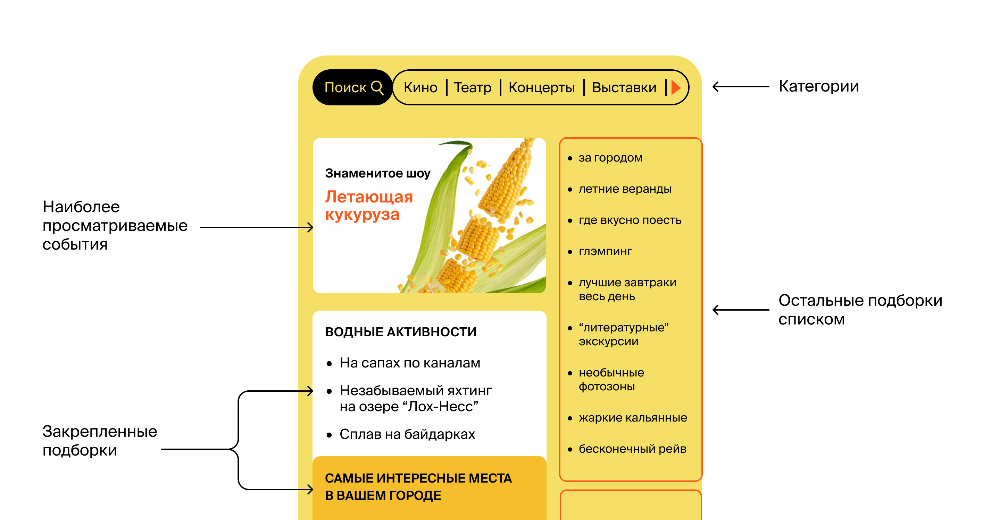
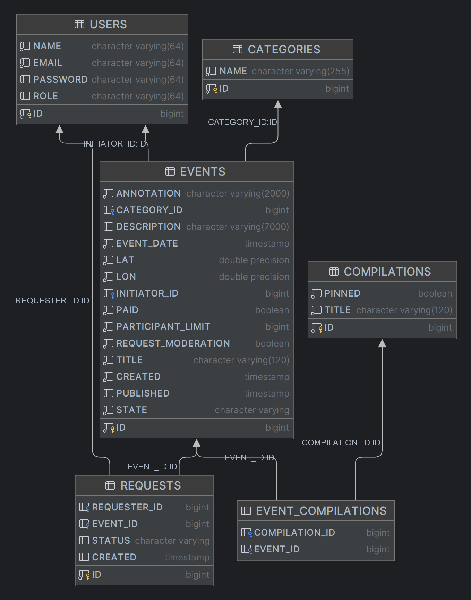
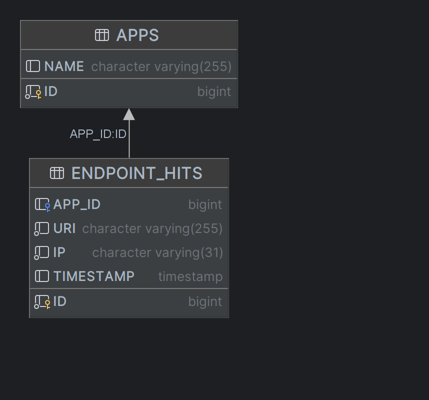

# Event calendar
### Приложение для организации событий и участия в них.
###### Приложение разработано в рамках прохождения учебного курса OTUS «Разработчик на Spring Framework»
***
Свободное время — ценный ресурс. Ежедневно мы планируем,
как его потратить — куда и с кем сходить. Сложнее всего в
таком планировании поиск информации и переговоры. Какие намечаются
мероприятия, свободны ли в этот момент друзья, как всех пригласить
и где собраться. Это приложение — афиша,
где можно предложить какое-либо событие от выставки до похода в кино
и набрать компанию для участия в нём.
Ниже представлен пример веб-интерфейса приложения.
 

## Основа приложения

Приложение состоит из двух микросервисов, каждый имеет свою базу данных.
Основной микросервис содержит всё необходимое для работы продукта.
Микросервис статистики хранит количество просмотров и позволяет делать различные выборки для
анализа работы приложения.
 Взаимодействие между микросервисами осуществляется через `restTemplate`.
  
API приложения разделено на доступное пользователям и доступное только администратору. Доступ к закрытому API осуществляется через Spring Security.

## Функционал

**Основной сервис** включает в себя функции для использования администраторами, авторизованными
пользователями и незарегистрированными пользователями.

  *__Администраторы могут__*:
 - управлять категориями для событий: добавлять, изменять и удалять категории.
 - управлять подборками мероприятий: добавлять, удалять и закреплять на главной странице.
 - модерировать события, размещённые пользователями: публиковать или отклонять.
 - управлять пользователями: добавлять, просматривать и удалять.
 - получать подробную информацию обо всех лайках/дизлайках указанного события.

  **_Авторизованные пользователи могут_**:
 - добавлять в приложение новые мероприятия, редактировать их и просматривать после добавления.
 - подавать заявки на участие в интересующих мероприятиях.
 - подтверждать заявки, которые отправили другие пользователи сервиса (доступно только для
организаторов событий).
 - ставить лайки/дизлайки событиям (только тем, в которых участвовали).
 - получать краткую информацию обо всех лайках/дизлайках своего события.

  **_Незарегистрированные пользователи могут_**:
 - просматривать список событий с краткой информацией по ним, в соответствии с выбранной
сортировкой (по количеству просмотров событий, по дате событий или по рейтингу событий).
 - просматривать подробную информацию о выбранном событии.
 - просматривать все имеющиеся категории событий.
 - просматривать подборки событий, составленные администратором.

Сервис статистики призван собирать информацию о количестве обращений пользователей к спискам событий и
о количестве запросов к подробной информации о событии.
  На основе этой информации формируется статистика о работе приложения.

## Схемы базы данных

## Спецификация

Спецификацию для сервисов можно посмотреть с помощью Swagger,
импортировав туда [файл](ec-main-service-spec.json) для основного сервиса
и [файл](ec-stats-service-spec.json) для сервиса статистики.

## Запуск приложения

Приложение готово для запуска в Docker. 

### Дальнейшие планы
- [ ] покрыть тестами
- [ ] переписать часть запросов с помощью querydsl
- [ ] расширить количество возможных сортировок
- [ ] реализовать веб-интерфейс с помощью Thymeleaf
- [ ] добавить возможность сохранения фотографий
- [ ] реализовать возможность добавления комментария к событиям
